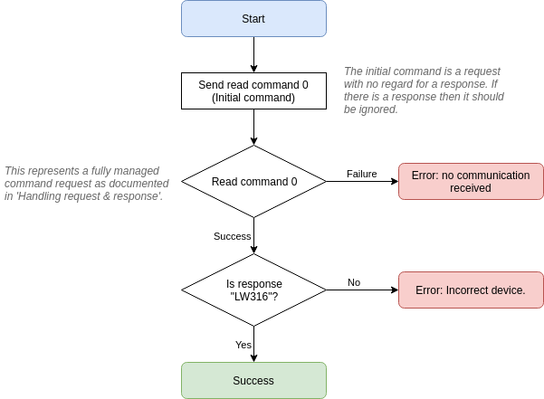

# Serial interface

## Overview

The LW20 has 3 protocols that run over the serial interface:
- HMI - Human to machine interface, configuration menus and ASCII distance output. 
- MMI - Machine to machine interface, ASCII based packets.
- LWNX - Packet based binary protocol with CRC checking.

The HMI and MMI protocols are documented in the LW20 manual as found at https://lightware.co.za. This document focuses on the LWNX protocol which can be used entirely standalone.

The LW20 will be waiting for interface selection after power up. By sending a command over the serial lines the LW20 will enter serial interface mode. While in serial mode, sending the LWNX read command for `Product name` will active LWNX mode.

!> The LW20 will not respond to the initial serial command, or the initial LWNX command. The connection process should consist of continually sending the LWNX `Product name` read command until a response is received. This guaranties that the LW20 is operating in LWNX over serial mode.

Communication is performed using encapsulated packets for both sending and receiving data. Every packet that is sent to the LW20 is known as a `request` and a correctly formatted request will always be replied to with a `response`. There are cases where the LW20 will send a request packet to the host, these packets are considered `streaming` packets as they arrive without a direct request from the host - they do not require a response from the host.

Requests are made using one of the available [commands](commands.md) and are either flagged as `read` or `write`. When a read request is issued then the response will contain the requested data. When a write request is issued then the contents of the response will vary depending on the command.

### Default serial interface properties
- Baud rate: `115200`
- Data: `8 bit`
- Parity: `none`
- Stop: `1 bit`
- Flow control: `none`

!> The default LW20 baud rate is `115200` but more advanced features of the LWNX protocol will require higher data rates.

## Packets

A packet for both requests and responses is composed of the following bytes:

<table>
    <tr>
        <td></td>
        <td colspan="3">Header</td>
        <td colspan="2">Payload</td>
        <td colspan="2">Checksum</td>
    </tr>
    <tr>
        <td>**Byte:**</td>
        <td>Start</td>
        <td>Flags Low</td>
        <td>Flags High</td>
        <td>ID</td>
        <td>Data 0 .. N</td>
        <td>CRC Low</td>
        <td>CRC High</td>
    </tr>
</table>

The `Start` byte is always 0xAA and indicates the beginning of a packet. It is important to veryify that the payload length is sane (0 to 1023 bytes) and that the checksum is valid before processing a packet, rather than just relying on the start byte.

The `Flags` bytes form a 16 bit integer that represents the payload length and read/write status of the packet. The payload length is inclusive of the ID byte and the required number of data bytes. The write bit is set to `1` to indicate write mode, or `0` to indicate read mode.

<table>
    <tr>
        <td>**Bit:**</td>
        <td>15</td><td>14</td><td>13</td><td>12</td><td>11</td><td>10</td><td>9</td><td>8</td><td>7</td><td>6</td><td>5</td><td>4</td><td>3</td><td>2</td><td>1</td><td>0</td>
    </tr>
    <tr>
        <td></td>
        <td colspan="10">Payload length (0 to 1023)</td>
        <td colspan="5">Reserved</td>
        <td>W</td>
    </tr>
</table>

The `ID` byte represents which command the request/response relates to.

There will be between 0 and 1023 `Data` bytes depending on the command type. Each command under the [detailed command descriptions](command_detail.md) section documents how the data bytes are used.

The `CRC` bytes form a 16 bit checksum value used to validate the integrity of the packet data. Every byte in the packet except for the CRC itself is included in the checkum calculation.

## Checksum
Each packet has a 2 byte checksum which is used to validate data integrity. The algorithm is `CRC-16-CCITT 0x1021` (idendtical to the one used for the XMODEM protocol).

The CRC must be correctly formed for the LW316 to accept and process packets. Below are some examples in various languages for CRC calculation:

**C/C++**
```c
uint16_t createCRC(uint8_t* Data, uint16_t Size)
{
    uint16_t crc = 0;

    for (uint32_t i = 0; i < Size; ++i)
    {
        uint16_t code = crc >> 8;
        code ^= Data[i];
        code ^= code >> 4;
        crc = crc << 8;
        crc ^= code;
        code = code << 5;
        crc ^= code;
        code = code << 7;
        crc ^= code;
    }

    return crc;
}
```

**Javascript**
```javascript
function createCRC(data, size) {
    let crc = 0;

    for (let i = 0; i < size; ++i) {
        let code = crc >>> 8 & 0xFF;
        code ^= data[i] & 0xFF;
        code ^= code >>> 4;
        crc = crc << 8 & 0xFFFF;
        crc ^= code;
        code = code << 5 & 0xFFFF;
        crc ^= code;
        code = code << 7 & 0xFFFF;
        crc ^= code;
    }

    return crc;
}
```
## Receiving packets

Here is the process for reading the raw serial byte stream and identifying packets. Once a packet has been successfully read it can be processed based on its command ID.


!> If the packet length or checksum is invalid then it is technically more correct to roll the incoming stream back to when the start byte was found. However in practice this has little appreciable impact.

## Handling request & response

Every request sent to the LW20 will receive a response, it is often useful to use the response as a way to determine if the request was received and processed.
Here is the recommended procedure for sending a command request and reading the response:


> The values used for timeout or number of retries should be tuned to the specific application.

## Initiating communication

The LW20 boots up in a communication agnostic mode and a single serial packet is required to initiate the serial interface. Here is the recommended procedure for establishing serial communication with the LW20:

